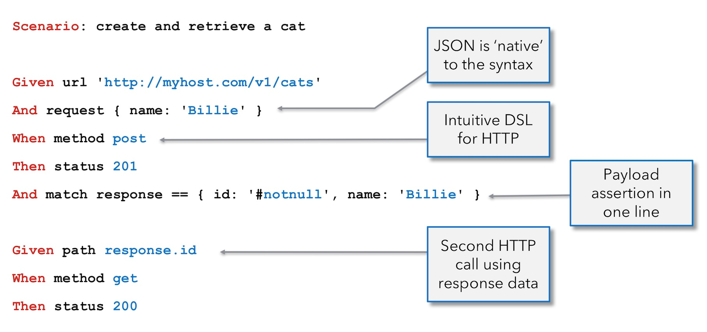

# Karate 介绍

Karate是将API测试自动化，mock server,性能测试，甚至UI自动化组合成一个单一的唯一开源工具**统一**框架。Cucumber流行的BDD语法与语言无关，即使非程序员也很容易。 内置强大的JSON和XML断言，您可以并行运行测试以提高速度。

测试执行和报告生成就像任何标准Java项目一样。 但是对于不熟悉Java的团队也有一个独立的可执行文件。 您不必编译代码。 只需使用简单易读的语法编写测试-精心设计用于HTTP，JSON，GraphQL和XML。 您可以在同一测试脚本中混合使用API​​和UI测试自动化。

> 如果您熟悉Cucumber / Gherkin，那么这里的最大区别是您不需要编写额外的“胶水”代码或Java“步骤定义”！

值得指出的是，JSON是语法的“一等公民”，因此您可以表达有效负载和期望的数据，而不必使用双引号，也不必将JSON字段名称括在引号中。 无需像使用Java或其他编程语言一样必须“转义”字符。而且，您无需为需要使用的任何有效负载创建其他Java类。

## Karate 相关内容介绍的Index
<table>
<tr>
  <th>Start</th>
  <td>
      <a href="#maven">Maven</a> 
    | <a href="#gradle">Gradle</a>
    | <a href="#quickstart">Quickstart</a>
    | <a href="https://github.com/intuit/karate/tree/master/karate-netty#standalone-jar">Standalone Executable</a>
    | <a href="#folder-structure">Naming Conventions</a>
    | <a href="#script-structure">Script Structure</a>
  </td>
</tr>
<tr>
  <th>Run</th>
  <td>
      <a href="#junit-4">JUnit 4</a>
    | <a href="#junit-5">JUnit 5</a>
    | <a href="#command-line">Command Line</a>
    | <a href="#ide-support">IDE Support</a>    
    | <a href="#tags">Tags / Grouping</a>
    | <a href="#parallel-execution">Parallel Execution</a>
    | <a href="#java-api">Java API</a>    
  </td>
</tr>
<tr>
  <th>Report</th>
  <td>
      <a href="#configuration">Configuration</a> 
    | <a href="#switching-the-environment">Environment Switching</a>
    | <a href="#test-reports">Reports</a>
    | <a href="#junit-html-report">JUnit HTML Report</a>
    | <a href="#logging">Logging</a>
  </td>
</tr>
<tr>
  <th>Types</th>
  <td>
      <a href="#json">JSON</a> 
    | <a href="#xml">XML</a>
    | <a href="#javascript-functions">JavaScript Functions</a>
    | <a href="#reading-files">Reading Files</a>
    | <a href="#type-conversion">Type / String Conversion</a>
    | <a href="#floats-and-integers">Floats and Integers</a>
    | <a href="#embedded-expressions">Embedded Expressions</a>
    | <a href="#jsonpath-filters">JsonPath</a>
    | <a href="#xpath-functions">XPath</a>
    | <a href="#karate-expressions">Karate Expressions</a>
  </td>
</tr>
<tr>
  <th>Variables</th>
  <td>
      <a href="#def"><code>def</code></a>
    | <a href="#text"><code>text</code></a>
    | <a href="#table"><code>table</code></a>
    | <a href="#yaml"><code>yaml</code></a>
    | <a href="#csv"><code>csv</code></a>
    | <a href="#type-string"><code>string</code></a>
    | <a href="#type-json"><code>json</code></a>
    | <a href="#type-xml"><code>xml</code></a>
    | <a href="#type-xmlstring"><code>xmlstring</code></a>
    | <a href="#type-bytes"><code>bytes</code></a>
    | <a href="#type-copy"><code>copy</code></a>
  </td>
</tr>
<tr>
  <th>Actions</th>
  <td>
      <a href="#assert"><code>assert</code></a>
    | <a href="#print"><code>print</code></a>
    | <a href="#replace"><code>replace</code></a>
    | <a href="#get"><code>get</code></a> 
    | <a href="#set"><code>set</code></a>
    | <a href="#remove"><code>remove</code></a>    
    | <a href="#configure"><code>configure</code></a>
    | <a href="#call"><code>call</code></a> 
    | <a href="#callonce"><code>callonce</code></a>
    | <a href="#eval"><code>eval</code></a>
    | <a href="#reading-files"><code>read()</code></a>
    | <a href="#the-karate-object"><code>karate</code> API</a>     
  </td>
</tr>
<tr>
  <th>HTTP</th>
  <td>
      <a href="#url"><code>url</code></a> 
    | <a href="#path"><code>path</code></a>
    | <a href="#request"><code>request</code></a>
    | <a href="#method"><code>method</code></a>
    | <a href="#status"><code>status</code></a>
    | <a href="#soap-action"><code>soap action</code></a>
    | <a href="#retry-until"><code>retry until</code></a>
  </td>
</tr>
<tr>
  <th>Request</th>
  <td>
      <a href="#param"><code>param</code></a> 
    | <a href="#header"><code>header</code></a>    
    | <a href="#cookie"><code>cookie</code></a>
    | <a href="#form-field"><code>form field</code></a>
    | <a href="#multipart-file"><code>multipart file</code></a>
    | <a href="#multipart-field"><code>multipart field</code></a>       
    | <a href="#multipart-entity"><code>multipart entity</code></a>    
    | <a href="#params"><code>params</code></a>
    | <a href="#headers"><code>headers</code></a>
    | <a href="#cookies"><code>cookies</code></a>        
    | <a href="#form-fields"><code>form fields</code></a>
    | <a href="#multipart-files"><code>multipart files</code></a>
    | <a href="#multipart-fields"><code>multipart fields</code></a>
  </td>
</tr>
<tr>
  <th>Response</th>
  <td>
      <a href="#response"><code>response</code></a>
    | <a href="#responsebytes"><code>responseBytes</code></a> 
    | <a href="#responsestatus"><code>responseStatus</code></a>
    | <a href="#responseheaders"><code>responseHeaders</code></a>
    | <a href="#responsecookies"><code>responseCookies</code></a>
    | <a href="#responsetime"><code>responseTime</code></a>
    | <a href="#responsetype"><code>responseType</code></a>
    | <a href="#requesttimestamp"><code>requestTimeStamp</code></a>
  </td>
</tr>
<tr>
  <th>Assert</th>
  <td>
      <a href="#match"><code>match ==</code></a>
    | <a href="#match--not-equals"><code>match !=</code></a>
    | <a href="#match-contains"><code>match contains</code></a>
    | <a href="#match-contains-only"><code>match contains only</code></a>
    | <a href="#match-contains-any"><code>match contains any</code></a>
    | <a href="#not-contains"><code>match !contains</code></a>
    | <a href="#match-each"><code>match each</code></a>
    | <a href="#match-header"><code>match header</code></a>    
    | <a href="#fuzzy-matching">Fuzzy Matching</a>
    | <a href="#schema-validation">Schema Validation</a>
    | <a href="#contains-short-cuts"><code>contains</code> short-cuts</a>
  </td>
</tr>
<tr>
  <th>Re-Use</th>
  <td>
      <a href="#calling-other-feature-files">Calling Other <code>*.feature</code> Files</a>
    | <a href="#data-driven-features">Data Driven Features</a>       
    | <a href="#calling-javascript-functions">Calling JavaScript Functions</a>
    | <a href="#calling-java">Calling Java Code</a>
    | <a href="#commonly-needed-utilities">Commonly Needed Utilities</a>
    | <a href="#data-driven-tests">Data Driven Scenarios</a>    
  </td>
</tr>
<tr>
  <th>Advanced</th>
  <td>
      <a href="#polling">Polling</a>
    | <a href="#conditional-logic">Conditional Logic</a>
    | <a href="#hooks">Before / After Hooks</a>
    | <a href="#json-transforms">JSON Transforms</a>
    | <a href="#loops">Loops</a>
    | <a href="#http-basic-authentication-example">HTTP Basic Auth</a> 
    | <a href="#http-header-manipulation">Header Manipulation</a> 
    | <a href="#text">GraphQL</a>
    | <a href="#async">Websockets / Async</a>
    | <a href="#call-vs-read"><code>call</code> vs <code>read()</code></a>
  </td>
</tr>
<tr>
  <th>More</th>
  <td>
      <a href="karate-mock-servlet">Mock Servlet</a>
    | <a href="karate-netty">Test Doubles</a>
    | <a href="karate-gatling">Performance Testing</a>
    | <a href="karate-core">UI Testing</a>
    | <a href="karate-robot">Desktop Automation</a>
    | <a href="https://github.com/intuit/karate/wiki/IDE-Support#vs-code-karate-plugin">VS Code / Debug</a>
    | <a href="#comparison-with-rest-assured">Karate vs REST-assured</a>
    | <a href="#cucumber-vs-karate">Karate vs Cucumber</a>
    | <a href="karate-demo">Examples and Demos</a>
  </td>
</tr>
</table>

## Karate 功能一览

* 不需要Java知识，甚至非程序员也可以编写测试
* 脚本是纯文本，不需要编译步骤或IDE，团队可以使用Git /标准SCM进行协作
* 基于流行的Cucumber / Gherkin标准-[IDE 支持](https://github.com/intuit/karate/wiki/IDE-Support)和语法着色选项
* 精美的[DSL](https://en.wikipedia.org/wiki/Domain-specific_language)语法' 本机”支持JSON和XML-包括JsonPath和XPath表达式
* 无需使用“ Java Beans”或“辅助代码”来表示有效负载和HTTP端点，并且极大地减少代码行
* Karate内置的[text-manipulation]（＃text）和[JsonPath](https://github.com/json-path/JsonPath#path-examples)功能可以非常方便的支持测试[GraphQL](http://graphql.org)API的高度动态响应
* Karate的测试用例是超级可读的-因为场景数据可以用人类友好的JSON,XML，Cucumber
* Karate将预期结果表示为可读性好,形成JSON或XML,并一步一步确认整个响应有效负载（无论多么复杂或深度嵌套）都符合预期
* 全面的[断言功能]，以及失败后清楚地报告哪个数据元素（和路径）与预期不符，以便对大型有效负载轻松进行故障排除* [全功能调试器](https://github.com/intuit/karate/wiki/IDE-Support＃vs-code-karate-plugin),可以方便的编辑测试用例
* 更简单,更强大的JSON-SCHEMA的替代方案对json schema进行验证
* 脚本可以调用其他脚本,这样就可以跨多个测试轻松地重用和维护身份验证并有效地“设置”流程
* 嵌入式JavaScript引擎 允许您构建适合您的特定环境或组织的可重用函数
* 支持不同环境运行测试
* 支持数据驱动的测试(data-driven-test),并且内置标记或分组(tags)测试
* 支持YAML甚至CSV文件读取-方便将它们用于数据驱动的测试
* 标准Java/Maven项目结构和无缝集成CI/CD/DEVOPS-并支持[JUnit 5]
* 可以用作轻量级[独立可执行文件](https://github.com/intuit/karate/tree/master/ karate-netty＃standalone-jar)-适用于不熟悉Java的团队
* 多线程并行执行,这节省了大量时间，尤其是对于集成和端到端测试
* 内置与Cucumber兼容的test-reports,甚至可以选择使用第三方maven插件来生成效果更好的报告
* 报告包括HTTP请求和响应日志,这使得故障排除和DEBUG更容易
* 轻松调用JDK类，Java库，或根据需要重新使用自定义Java代码，以实现最终可扩展性
* 身份验证和HTTP头管理的简单插件,可以处理任何复杂的实际情况
* HTTP客户端抽象,目前支持Apache和Jersey
* 跨浏览器Web UI自动化
* 跨平台karate Robot(实验阶段),可以根据需要混合到Web Automation流中
* 通过Java API调用的选项，这意味着您可以轻松地将Karate混入Java项目或旧版UI自动化中
* Karate支持将测试用例转化为gatling的测试用例，方便性能测试
* 性能测试工具Gatling集成到任何自定义Java代码中-这意味着甚至可以对非HTTP进行性能测试协议，例如[gRPC](https://github.com/thinkerou/karate-grpc)
* 内置的[分布式测试功能](https://github.com/intuit/karate/wiki/Distributed-Testing)适用于API,UI甚至性能测试
* [API mocks](karate-netty) or test-doubles that even [maintain CRUD 'state'](https://hackernoon.com/api-consumer-contract-tests-and-test-doubles-with-karate-72c30ea25c18) across multiple calls - enabling TDD for micro-services and [Consumer Driven Contracts](https://martinfowler.com/articles/consumerDrivenContracts.html)
* 异步async支持，无缝集成自定义事件的处理或侦听消息队列
* karate-mock-servlet，无需启动应用服务器就能够测试任何servlet,例如Spring Boot/MVC或Jersey/JAX-RS-，并且可以使用HTTP集成
* 支持不同的API访问协议:
  * SOAP/XML requests
  * HTTPS/SSL- without needing certificates, key-stores or trust-stores
  * HTTP proxy server
  * URL-encoded [HTML-form](#form-field) data
  * [Multi-part](#multipart-field) file-upload - including `multipart/mixed` and `multipart/related`
  * Browser-like [cookie](#cookie) handling
  * 处理HTTPheaders,path and query parameters
  * 有条件的重试机制
  * [Websocket](http://www.websocket.org) 支持
