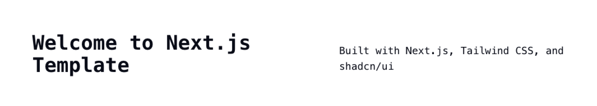

# Setup Projec

Create a new project as template project, tech stack:
1. bun
2. turbo/vite/vitest
3. nextjs 
4. tailwindcss
5. shadcn-ui
6. typescript


## Setup

```sh
ncu -u
bun install 
bun run de
```

## Done

